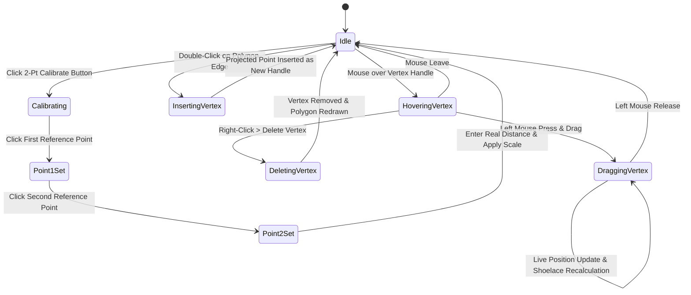

# New Planimeter - Process & Workflow Flowcharts

## 1. End-to-End System Workflow

```mermaid
flowchart TD
    Start(["Start Application"]) --> LoadImg["User Loads 2D Image / Survey Plan"]
    
    LoadImg --> CheckDistort{"Is image perspective distorted?"}
    CheckDistort -- Yes --> PerspWarp["4-Point Perspective Rectification (Homography)"]
    CheckDistort -- No --> Preprocess["Image Preprocessing Pipeline"]
    PerspWarp --> Preprocess
    
    subgraph CV Pipeline
        Preprocess --> Gray["Grayscale Conversion"]
        Gray --> Blur["Bilateral / Gaussian Denoising"]
        Blur --> CLAHE["Contrast Enhancement (CLAHE)"]
        CLAHE --> Thresh["Otsu / Adaptive / Canny Thresholding"]
        Thresh --> Morph["Morphology (Closing / Dilation)"]
        Morph --> Extract["Contour Extraction & Ranking"]
    end
    
    Extract --> ModeSelect{"Select Measurement Mode"}
    
    ModeSelect -- "Semi-Automatic (Default)" --> UserClick["User Clicks Region on Canvas"]
    UserClick --> MatchContour["Find Closest / Enclosing Contour"]
    MatchContour --> Vectorize["Douglas-Peucker Approximation (ε)"]
    
    ModeSelect -- "Automatic" --> AutoContour["Auto-Pick Largest Closed Boundary"]
    AutoContour --> Vectorize
    
    ModeSelect -- "Manual Draw" --> ManualClick["Point-by-Point Vector Drawing"]
    ManualClick --> ClosePoly["Close Polygon Loop"]
    ClosePoly --> Validate
    
    Vectorize --> EditCheck{"Need Manual Correction?"}
    EditCheck -- Yes --> EditHandles["Drag / Add / Delete Vertex Handles"]
    EditCheck -- No --> Validate["Polygon Validation & Self-Intersection Check"]
    EditHandles --> Validate
    
    Validate --> Valid{"Is Polygon Valid?"}
    Valid -- No --> FixErr["Show Error Badge (Self-intersecting / Collinear)"]
    FixErr --> EditHandles
    
    Valid -- Yes --> CalibCheck{"Is Scale Calibrated?"}
    CalibCheck -- No --> Calib["User Selects 2 Reference Points & Enters Distance"]
    Calib --> CalibScale["Compute Scale Factor S (units/px)"]
    CalibCheck -- Yes --> Transform["Transform to CAD Cartesian Coordinates (Y-Up)"]
    CalibScale --> Transform
    
    Transform --> Shoelace["Compute Real Area via Shoelace Formula"]
    Shoelace --> Perim["Compute Euclidean Perimeter"]
    Perim --> DisplayGUI["Display Live Area, Perimeter, and Vertices in GUI"]
    
    DisplayGUI --> Export{"AutoCAD Export / Action"}
    Export --> ExportJSON["Export Structured JSON Coordinate Payload"]
    Export --> ExportSCR["Generate AutoCAD Script (.SCR) & AutoLISP (.LSP)"]
    
    ExportJSON --> CADPlugin["AutoCAD .NET Plugin (IMPORTPLANIMETER)"]
    ExportSCR --> CADDrag["AutoCAD Script Drag-and-Drop Execution"]
    
    CADPlugin --> DrawPoly["AutoCAD Creates Closed Polyline (IMAGE_AREA_BOUNDARY)"]
    CADDrag --> DrawPoly
    DrawPoly --> DrawText["AutoCAD Places MText Centroid Area Label (IMAGE_AREA_LABEL)"]
    DrawText --> ZoomExt["AutoCAD Zooms to Extents (ZOOM E)"]
    ZoomExt --> QueryArea["AutoCAD Queries Native pline.Area"]
    
    QueryArea --> Verify["Accuracy Verification Engine"]
    Shoelace --> Verify
    Verify --> AccuracyReport["Generate Comparative Error Report & Tolerance Check"]
    AccuracyReport --> End(["End Workflow"])
```

---

## 2. Interactive Vertex Manipulation State Machine

```mermaid
stateDiagram-v2
    [*] --> Idle
    
    Idle --> HoveringVertex: Mouse over Vertex Handle
    HoveringVertex --> Idle: Mouse Leave
    
    HoveringVertex --> DraggingVertex: Left Mouse Press & Drag
    DraggingVertex --> DraggingVertex: Live Position Update & Shoelace Recalculation
    DraggingVertex --> Idle: Left Mouse Release
    
    Idle --> InsertingVertex: Double-Click on Polygon Edge
    InsertingVertex --> Idle: Projected Point Inserted as New Handle
    
    HoveringVertex --> DeletingVertex: Right-Click > Delete Vertex
    DeletingVertex --> Idle: Vertex Removed & Polygon Redrawn
    
    Idle --> Calibrating: Click 2-Pt Calibrate Button
    Calibrating --> Point1Set: Click First Reference Point
    Point1Set --> Point2Set: Click Second Reference Point
    Point2Set --> Idle: Enter Real Distance & Apply Scale
```
