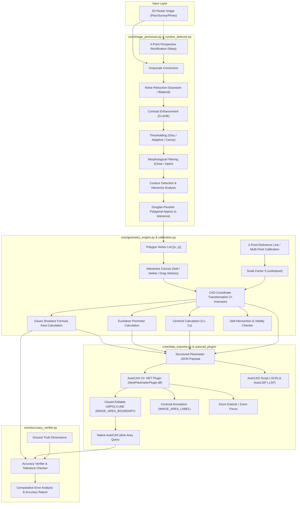

# New Planimeter - System Architecture & Engineering Specification

## 1. System Overview
**New Planimeter** is a PC-based engineering application designed to accurately calculate the surface area and perimeter of irregular-shaped plots, civil survey drawings, and architectural plans from 2D raster imagery (JPG, PNG, TIFF, BMP) and seamlessly integrate with Autodesk AutoCAD.

The system operates 100% locally on the user's workstation without requiring cloud services, IoT hardware, Arduino/ESP32 devices, or GPS sensors.



---

## 2. Mathematical Formulations

### 2.1 Gauss's Shoelace Area Formula
For an $n$-sided polygon with vertices $(x_0, y_0), (x_1, y_1), \dots, (x_{n-1}, y_{n-1})$ in calibrated Cartesian coordinates:

$$A = \frac{1}{2} \left| \sum_{i=0}^{n-1} (x_i y_{i+1} - x_{i+1} y_i) \right|$$

where $(x_n, y_n) = (x_0, y_0)$.

### 2.2 Perimeter Formula
$$P = \sum_{i=0}^{n-1} \sqrt{(x_{i+1} - x_i)^2 + (y_{i+1} - y_i)^2}$$

### 2.3 Centroid Computation (Center of Mass)
$$C_x = \frac{1}{6A} \sum_{i=0}^{n-1} (x_i + x_{i+1})(x_i y_{i+1} - x_{i+1} y_i)$$
$$C_y = \frac{1}{6A} \sum_{i=0}^{n-1} (y_i + y_{i+1})(x_i y_{i+1} - x_{i+1} y_i)$$

### 2.4 Scale Calibration
- **2-Point Known Reference**:
  Given reference endpoints $P_1 = (x_1, y_1)$ and $P_2 = (x_2, y_2)$ in image pixels and known real distance $D_{real}$:
  $$d_{px} = \sqrt{(x_2 - x_1)^2 + (y_2 - y_1)^2}$$
  $$S = \frac{D_{real}}{d_{px}} \quad (\text{real units / pixel})$$

- **Multi-Point Least-Squares Calibration**:
  Given $m$ reference bars with pixel lengths $d_{px, k}$ and real lengths $D_{real, k}$:
  $$S = \frac{\sum_{k=1}^m d_{px, k} \cdot D_{real, k}}{\sum_{k=1}^m d_{px, k}^2}$$

### 2.5 Coordinate Inversion (Raster Space to CAD Cartesian Space)
Raster images have origin $(0, 0)$ at the top-left with $Y$ increasing downwards. AutoCAD Cartesian space has origin $(0, 0)$ at the bottom-left with $Y$ increasing upwards:

$$X_{cad} = X_{px} \cdot S$$
$$Y_{cad} = (H_{px} - Y_{px}) \cdot S$$

where $H_{px}$ is the total image height in pixels and $S$ is the calibration scale factor.

---

## 3. Data Dictionary: Structured JSON Schema

```json
{
  "metadata": {
    "application": "New Planimeter",
    "version": "1.0.0",
    "export_timestamp": "2026-09-22T20:30:00.000000",
    "source_image": "triangle_plot.png",
    "image_width_px": 1200,
    "image_height_px": 800
  },
  "calibration": {
    "scale_factor": 0.05,
    "unit": "m",
    "is_calibrated": true,
    "calibration_type": "2-point",
    "known_distance": 10.0,
    "pixel_distance": 200.0,
    "pixels_per_unit": 20.0
  },
  "geometry": {
    "vertex_count": 3,
    "area": 300.0,
    "area_unit": "m²",
    "perimeter": 86.0555,
    "perimeter_unit": "m",
    "centroid_cad": { "x": 20.0, "y": 20.0 },
    "centroid_px": { "x": 400.0, "y": 400.0 },
    "cad_vertices": [
      { "x": 15.0, "y": 10.0 },
      { "x": 45.0, "y": 10.0 },
      { "x": 15.0, "y": 30.0 }
    ],
    "image_vertices_px": [
      { "x": 300.0, "y": 600.0 },
      { "x": 900.0, "y": 600.0 },
      { "x": 300.0, "y": 200.0 }
    ]
  },
  "autocad_settings": {
    "boundary_layer": "IMAGE_AREA_BOUNDARY",
    "boundary_color_index": 4,
    "label_layer": "IMAGE_AREA_LABEL",
    "label_color_index": 2,
    "text_height": 1.0,
    "auto_zoom": true,
    "create_closed_polyline": true,
    "annotate_area": true
  }
}
```

---

## 4. AutoCAD .NET Plugin Architecture

The C# plugin (`NewPlanimeterPlugin.dll`) leverages the official `Autodesk.AutoCAD.Runtime` and `Autodesk.AutoCAD.DatabaseServices` APIs:
1. **Transaction Isolation**: Executes within `DocumentLock` and `Database.TransactionManager` transaction.
2. **Layer Auto-Creation**: Checks and registers `IMAGE_AREA_BOUNDARY` (Cyan / ACI 4) and `IMAGE_AREA_LABEL` (Yellow / ACI 2) if not present.
3. **`Polyline` Construction**: Appends 2D vertices to a lightweight polyline (`LWPOLYLINE`), closes the loop (`Closed = true`), and writes to `ModelSpace`.
4. **Native Area Query**: Queries `pline.Area` and `pline.Length` directly from AutoCAD's geometric database engine.
5. **Centroid Annotation**: Appends formatted `MText` displaying Area, Perimeter, and Units at the polygon's centroid.
6. **Viewport Zooming**: Dispatches `_.ZOOM _E` to fit the generated geometry in the active drawing view.
7. **Verification Response**: Exports `autocad_verification_result.json` back to disk for automatic discrepancy checking.
